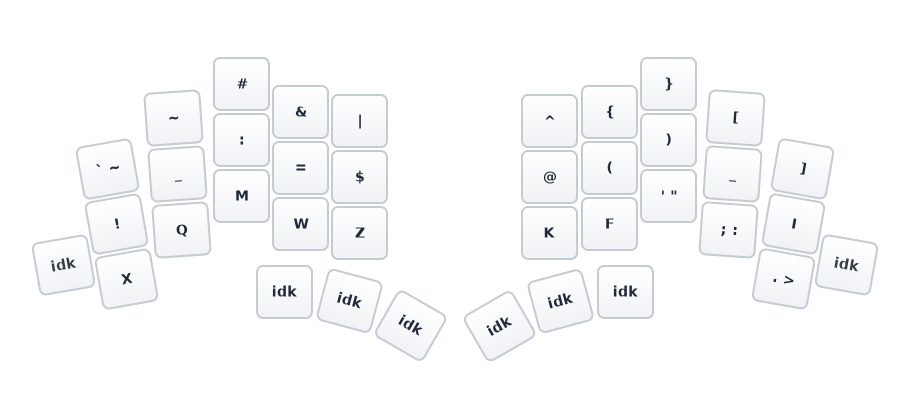
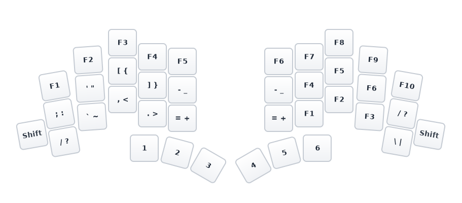

## Reference

-  https://www.reddit.com/r/KeyboardLayouts/comments/1iqo9ob/galite_galliumgraphite_hybrid_with_simplified/
<!--  -->

- **Keyboard:** Totem
- **Keys**: 3x5 + 1, 3 thumb keys per hand (38 total)
- **Layout:** Gallium
- **Firmware:** ZMK
- **Layers:** TBD

## Layers

### Base Layer


```
Left Hand     Right Hand
B L D C V     J Y O U ,
N E T S G     P H A E I
X Q M W Z     K F ' ; .
```

<!--
### Symbol Layer

```
Left Hand     Right Hand
` < > - \     ^ { } $ |
! * / = &     # ( ) ; "
~ + [ ] %     @ : , . '
```


-->

### Number/Symbol Layer


### Nav Layer


- arrow up/down/left/right keys, home/end, pg up/down
- mouse up/down/left/right keys, mouse buttons left/right/center, scroll up/down/left/right, mouse jiggler.
- Caps Lock, Copy, Paste, Cut, and Undo, Redo, ScrLock, NumLock, hyper, meh,


### Func Layer




- arrow up/down/left/right keys, home/end, pg up/down
- mouse up/down/left/right keys, mouse buttons left/right/center, scroll up/down/left/right, mouse jiggler.
- Caps Lock, Copy, Paste, Cut, and Undo, Redo, ScrLock, NumLock, hyper, meh,
