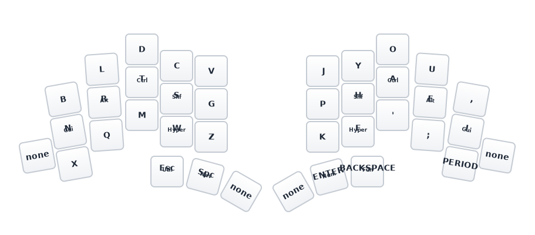
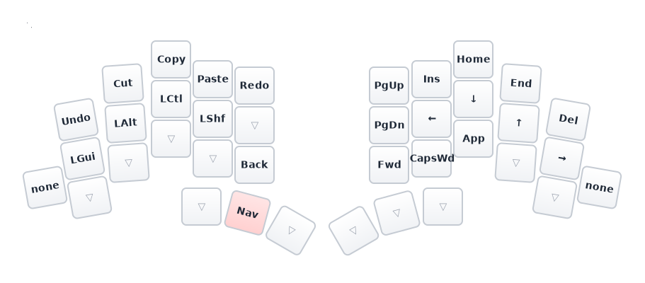
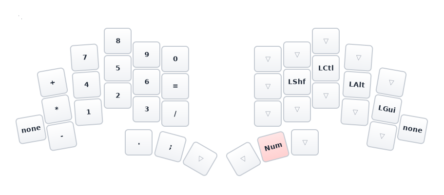
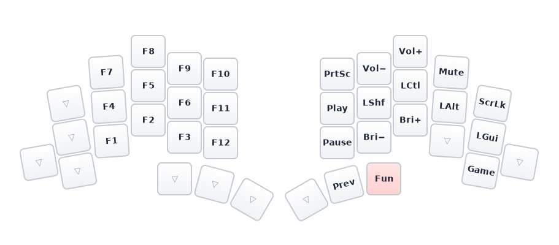
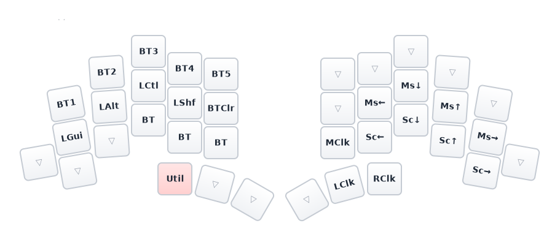
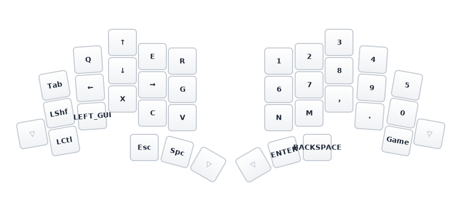

# TOTEM

ZMK firmware for the [TOTEM](https://github.com/GEIGEIGEIST/TOTEM) 38-key split keyboard by GEIGEIGEIST, running on two Seeed XIAO nRF52840 Sense controllers.

## Layout

**Gallium** alpha layout with home row mods (GACS order), 33 combos, 2 mod-morphs, mouse keys, and 6 layers.

### Base (Gallium)



- **Home row mods** (GACS): Gui/Alt/Ctrl/Shift on left, mirrored on right
- **Hyper** (all 4 mods) on W and F
- **Mod-morphs**: `,` -> `;` and `.` -> `:` when shifted
- **Side buttons** (pos 20/31): dedicated LShift / RShift

### Nav (hold Space)



### Num (hold Backspace)



### Fun (hold Delete)



### Util + Mouse (hold Escape)



### Game (toggle from Fun layer)



## Combos (80ms timeout, Base layer)

All combos are vertical (top+home or home+bottom) or horizontal (adjacent keys).

```
Left vertical (top + home):           Right vertical (top + home):
  B+N  = Play/Pause                     J+P  = ^
  L+R  = @                              Y+H  = +
  D+T  = #                              O+A  = *
  C+S  = $                              U+E  = &
  V+G  = %

Left vertical (home + bottom):        Right vertical (home + bottom):
  N+X  = Mute                           P+K  = _
  R+Q  = `                              H+F  = -
  T+M  = \                              A+'  = /
  S+W  = =                              E+;  = |
  G+Z  = ~                              I+,  = Vol+
                                        ./: + I = Vol-

Left horizontal:                       Right horizontal:
  R+T+S = Esc                            Y+O  = [    O+U  = ]
  Q+W   = Cut (Ctrl+X)                   H+A  = (    A+E  = )
  Q+M   = Copy (Ctrl+C)                  F+'  = {    '+;  = }
  M+W   = Paste (Ctrl+V)                 P+H  = <    E+I  = >

Other:
  S+H       = Caps Word
  LShf+RShf = ZMK Studio unlock
```

## Home Row Mods

| Setting | Value |
|---|---|
| Flavor | balanced (positional hold-tap) |
| Tapping term | 280ms |
| Quick tap | 175ms |
| Require prior idle | 150ms |
| Hold trigger | opposite hand + thumbs only |

Thumb layer-taps use **hold-preferred** flavor with 200ms tapping term for fast layer activation.

## Hardware

| Component | Detail |
|---|---|
| Keyboard | TOTEM by GEIGEIGEIST |
| Controllers | 2x Seeed XIAO nRF52840 Sense |
| Keys | 38 (3x5 + 1 side + 3 thumb per hand) |
| Matrix | 4x10 (col2row) |
| Connection | USB-C or Bluetooth (5 profiles) |

## Building

### Local (Nix)

```bash
nix develop          # enter dev shell
totem                # build left + right + settings_reset
totem bootloader     # download XIAO bootloader
totem update         # west update
```

Outputs go to `build/`:
- `totem-zmk-left.uf2` (central)
- `totem-zmk-right.uf2` (peripheral)
- `totem-zmk-settings-reset.uf2` (bond/settings reset)

### GitHub Actions

Push to `config/` triggers a build via ZMK's reusable workflow. Download UF2 artifacts from the Actions tab.

### Regenerate layer SVGs

```bash
gen-svg    # regenerates assets/svg/layers/*.svg from keymap
```

## Flashing

1. Double-tap reset on the XIAO to enter UF2 bootloader (mounts as `XIAO-SENSE`)
2. Copy the appropriate `.uf2` file to the mounted drive
3. Flash left half first, then right half

To clear Bluetooth bonds, flash `totem-zmk-settings-reset.uf2` on **both** halves, then reflash the regular firmware.

## ZMK Studio

Runtime keymap editing is enabled. Unlock with the **LShift + RShift** combo (key positions 20 + 31).
